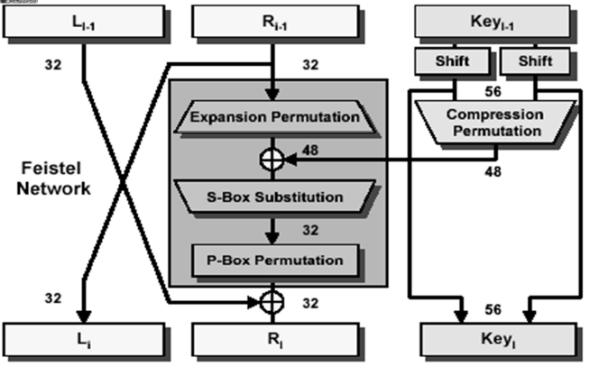
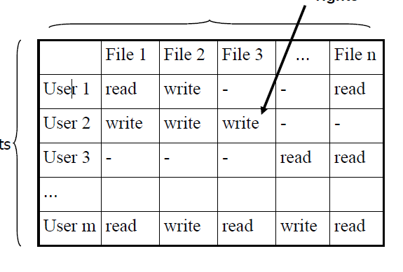
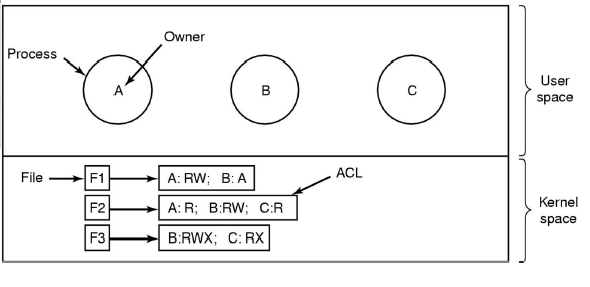
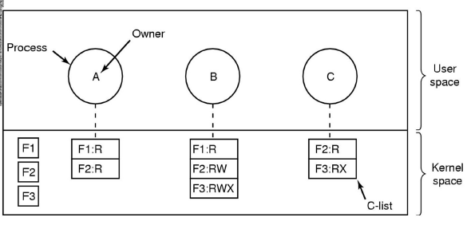
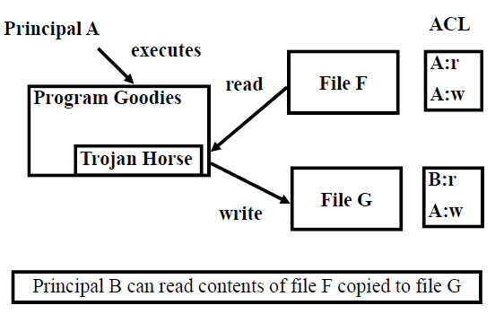
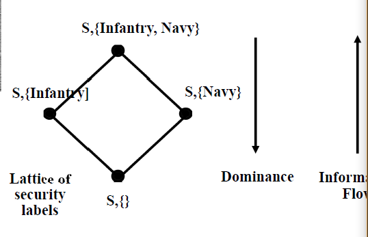
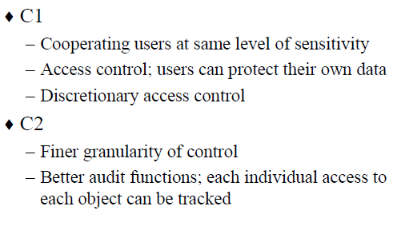

# 信安复习笔记
## Basic of information security
* 策略定义安全，机制实现策略
    - Confidentiality 保密性-对信息和资源的隐藏
        - 访问控制机制
    - Integrity 完整性-数据或资源的可信度
        - 预防机制和检测机制
        - 数据完整性和来源完整性
    - Availability 可用性-能够访问数据和数据源
* Trust and knowing assumptions(安全以此为基础)（用假设判断策略是否正确描述了所需要的安全等级）
    - 需考虑安全各个方面
    - 策略的公理（制定策略需要的假设）
        - 正确地获取并满足安全需求
        - 正确地区分“安全”“非安全”的状态
        - 安全策略可由安全机制实施
    - 机制
        - 假设机制是执行策略的；
        - 多种机制的并集实现了安全策略的所有规定
        - 机制都被正确实现并被安装和管理
        - 机制依赖基础设施的支持 
        - secure precise partial 三种机制
* assurance 安全保障
    - Assurance：测量多大程度上可以信任系统会做其应做的事情。
    - 规范（specification）
        - 系统的目的被规范定义
        - 对预期功能的声明，并非对规范本身
    - 设计（design）
        - 系统如何满足规范
    - 实现（impomentation）
        - 创建符合该设计的系统
* 运作问题
    - 开销分析
        - 预防和恢复
    - 风险评估
        - 我们需要保护某一件东西吗？
        - 花多大力气去保护？
    - 法律与人的习惯
        - 这种行为合法吗？法律会支持这种行为吗？
* The human factor
    - 技术30%，管理70%
    - 组织问题
        - 能力和责任
        - 经济受益
    - 人的问题（安全系统的核心是人）
        - 外部人员和内部人员（）后者威胁更大
        - 未经训练的人员
        - 利用人性弱点的社会工程学技术
* 信息安全的目标
    - 预防
    - 发现
    - 修复
* 一些常见攻击
    - Passive attacks：监听
    - Active attacks：修改、延迟、重放、拒绝
    ```
    DOS攻击：发送pin数据包，发送地址填A，接收地址是局域网上的广播地址，然后局域网中所有机子会向A回复引起宕机
    ```
## 2.1 history
* 早期的密码都是怎么被攻破的？
    - 无法通过Frequency Analysis.频率分析
    - 一些英文单词的出现频率要大于其他单词
* 维吉尼亚方阵
    - 传统的频率分析无用了
    - 秘钥不断重复，密钥是第几个就找到R行的代替
    - 混合使用offset和lineorder，一横一竖（KRYPTOS PALIMPSEST）

* **维吉尼亚方阵破译**
    - 重复关键字会导致密文中的重复。
    - 然后可以通过找出密文中重复间隔的因数来确定关键字的长度。
    - Example: The sequence T-H-J-D repeats after 18 spaces. The
        numbers 1, 2, 3, 6, and 9 are all factors of 18. Therefore, possibly:
        – The key is 1 letter long and repeats 18 times. (Can be discounted)
        – The key is 2 letters long and repeats 9 times.
        – The key is 3 letters long and repeats 6 times.
        – The key is 6 letters long and repeats 3 times.
        – The key is 9 letters long and repeats 2 times.
    - 通过检测过个重复元素寻找可能长度，然后通过设长度，频率分析解答（每一个都是凯撒偏移量密码）

* 一次性密码本
    - Works when one unique key is used once to encipher/decipher one message.
* 秘钥分配问题
    - 为何一次性密码本没有被推广？
    - One time keys must be at least as long as the messages
        they encipher.
        – Keys must be communicated between parties outside of
        the enciphered channel.
        – Keys can only be used once.
    - 首先手上要有一本一次性密码本用以加密文件，接着将一次性密码本里的字母，与被加密文件的字母给依序按某个事先约定的规定一一相混，其中一个相混的作法是将字母指定数字(如在英语中，将A至Z依序指定为0至25)然后将一次性密码文本上的字母所代表的数字和被加密文件上相对应的数字给相加，再除以该语言的字母数，假设是n(如英语为26)，若就此得出来的某个数字小于零，则将该小于零的数给加上n，如此便完成加密。

    - 举个例子，若要加密讯息“This is an example”，而用以加密的一次性密码本如下所示：
    MASKL NSFLD FKJPQ
    则利用指定数字的方法，可分别将两者给做以下的转换：
    This is an example → 19 7 8 18 8 18 0 13 4 23 0 12 15 11 4
    MASKL NSFLD FKJPQ → 12 0 18 10 11 13 18 5 11 3 5 10 9 15 16
    两者依序相加后得到的讯息如下：
    31 7 26 28 19 31 18 18 15 26 5 22 24 26 20
    将以上得到的讯息模26后可得：
    5 7 0 2 7 5 8 8 11 0 5 22 24 0 20
    它也就变成了
    FHACHFIILAFWYAU
    而若要解密以上信息，反向操作即可。

    * Beale Papers

    * 第二纪元
    * 恩尼格马
        - 26 * 26 * 26 = 17,576 possible cipher alphabets
        - 17576 * 6 = 105456
        Pressing the ‘a’ key would cause a circuit to be created through the
        rotors and illuminate the letter ‘B’ on the lamp board. ‘B’ is the
        ciphertext. The first rotor would then click forward one position.The rotors advanced as keys were pressed. Once rotor one completed a complete revolution of 26 characters, rotor two would click forward once, and so on.
        - 100,391,791,500 possible plug board settings（怎么算的）？
        - 3 rotors 17,576
          6 rotor orientations 6
          6 plug board settings 100,391,791,500
        - http://www.codesandciphers.org.uk/enigma/steckercount.htm
    * 恩尼格码破解
## 2.2 brief intro to cryptography
* 术语
    - 加密过程
    - 解密过程
    - 符号
        - P Plaintext
        - C Ciphertext
        - E Encryption function
        - D Decryption function
        - E(P) = C encrypting plaintext yields ciphertext
        - D(C) = P decrypting ciphertext yields plaintext
    - Restrict Algorithm
        - 算法需要保密
    - Key-Based Alogrithm
        - 秘钥需要保密
    - 攻击
        - 只获得密文
        - 知道一些密文和明文的对应
        - 攻击者可以将任何明文加密（破解）
        - 真正的攻击一般不会破坏加密性（算法）本身；
        - 如猜秘钥攻击
    - 加密算法种类
        - Secert-key 秘密秘钥（对称）
        - public-key 公钥（非对称）
        - 数字签名和哈希算法
    - 对称加密
        - 同一把秘钥——两端加密解密
        - 两个算法——加密算法和解密算法
        - 秘钥必须事先分发
    - 堆成加密要点
        - 防窃听
            - 安全频道进行交易
        - 安全存储
            - 记住密码
        - 认证
            - challenge /response
        - 完整性监察
            - 消息校验和 - 加密校验和
    - substition Cipher
        - Modern substitution ciphers take in N bits
            and substitute N bits using lookup table:
            called S-Boxes
    - Transposition cipher(转置)
        - 文本横着插进去，密文竖着放出来（P-BOX）
    - Block Cipher
        - n bit n bit加密，不考虑块与块之间的影响
        - In a good block cipher, each output bit is a function of all n input bits and all k key bits
    - DES
        - 加密：用KA，将文件编码为64bit 的chunk
        - key  56bit + 8bit parity
        - 解密：再用一次KA，以密文为输入，除了key是倒序的；
        - 64 plain-> 16  iteration (with 56bit key)->32 bie swap -> inverse trans -> output
        - iteration:L(i-1)异或f(R(i-1),Ki)为新的Ri-1，原Ri1为Li-1
        - </img>
        - 攻破原因：Key is only 56bits, 2 exp 56 72,057,584,037,927,936– Computing capability is increasing exponentially– Parallel attack – exhaustively search key space

    - Beyond DES
        - Triple DES put the output of DES back as input into DES again with a different key, loop again: 3*56 = 168 bit key
        - AES shall be designed so that the key length may be increased as needed. block size n = 128 bits, key size k = 128, 192, 256 bits
        - MARS, twofish, RC6, Serpent, Rijndael – Winner! (Rijndael)
        - 针对块的两种攻击方式
            - ciphertext only attacks，利用现有密文
            - build a codebook of <Ck, guessed Pk> pairs (chosen plaintext attacks). Replay Attacks?
            - 阻止方式：Inhibits replay attacks and codebook building: identical input plaintext Pi = Pk won’t result in same output code due to memory-based chaining. IV = Initialization Vector use only once
        - 流加密
            -   Rather than divide bit stream into discrete blocks,
                as block ciphers do, XOR each bit of your plaintext
                continuous stream with a bit from a **pseudo-random sequence**
                key -> PRS
                PLAIN XOR PRS = Cipher
                • At receiver, use same symmetric key, XOR again to
                extract plaintext
            - 上一个加密的s1成为新的key，然后变成s2，以此类推
            - 同样有sender IV 和 receiver IV
        - 非对称加密
            - 对称加密的问题：若未曾谋面，如何递交秘钥？且记忆大量秘钥成本太高了；
            - SINGLE MOST IMPORTANT
        - 非对称加密机制
            - plain->bob公开的公钥和算法->bob自己的秘密私钥解密->plain
            - 私钥不可通过公钥获得
            - 公钥直接公开就行
        - 具体实现（RSA）
            - 公钥：（e，n）
            - 加密： c=m^e mod n
            - 私钥：d
            - 解密： c^d mod n
            - e，n，d选择：
                - chooses 2 large primes (each at least 100
                    digits): p, q
                    multiplies p and q: n = p*q
                    – finds out two numbers e & d such that
                    e * d = 1 (mod (p-1)(q-1))
            - 一些说明
                - 信息m的大小介于[1，n]；
                - 加密长信息：hybrid cryptosystem
        - 为什么RSA安全？
            - 破解策略：偷到私钥
            - 知道原理后暴搜（时间长）
            - 通过原理计算d problem: Given two numbers (r,s), the algorithm outputsa number x such that r * x = 1 (mod s).
            - 时间开销主要在n = p * q 分解上
            - 但是乘起来容易分解难！
            - longer than 155 decimal digits 更安全
            - 更为好的方法：伪造一个自己的钥匙对，发消息欺骗alice换公钥了！
                - 使用数字签名防止
        - 私钥算法和公私钥算法的优劣
            - 公私钥算法慢，代价昂贵， VLSI chip难以获得或昂贵
            - 私钥中密码分配很成问题
        - 结合
            -  用公钥算法分发钥匙，用私钥算法加密信息
        - 数字签名的必要性
            - 用私钥加密，用公钥解密(Bob->Chthy)
            - s= md mod n
            - t = se mod n
            - (e,n)
            - [0,n]
        - 很长文本签名用哈希
            - 先hash数据，然后为哈希后的数剧签名
        - 单向哈希-MD5（128），SHA-1（160）
            - 进去长度不定，出来一定是这个长度
        - **好的单向哈希算法**
            - 易于分析（计算）（amy document很快出结果）
            - 难以逆运算（单向）
            - 难以发现冲突（两个不同的数据几乎不可能有相同哈希值）
            - MD5，SHS,HAVAL
        - 数字签名？
            - 不可伪造；（unforgeble）
            - 签字人不可否认
            - 可被广泛验证
            - doc之间不同
            - 易于实现
        - 重要签名技术
            - RSV, Schnorr。 DSS，椭圆曲线
        - MD5被破解

## 3.1 Authentication 认证
* 基本问题
    - 如何证明你是你？
* 多种方式
    - 密码秘钥
    - 哪里：ip
    - 物理和行为
    - 安全标记
* 基于密码的
    - 容易被窃听
    - 密码文件不容易保守秘密
    - 猜出一个简单密码很容易
    - 系统如何检测密码？
        - Unix 策略——哈希
            - 存储密码的哈希（文件危险问题解决）
            - 用户输入密码后先转换成哈希在比对
            - 单向哈希
        - 传统unix策略：使用des以密码为key加密null串
            - password -> 8 char
            - run 25 times
        - 问题：密码并非完全随机
            - 可穷举
            - 人们倾向于用有意义文本做密码
        - 传统字典攻击方式
            - 找到密码文件，找到各种userID
            - 计算字典中所有word的哈希一个一个试，因为字典往往不大
        - 解决策略1：salting
            - 密码第一次设定时随机选择，接在密码前面一起哈希
            - 用户拥有相同密码可能有不同的密码文件
            - 但是字典攻击仍然存在
            - 优点：防止预先建立字典哈希表一一对照。攻击者必须对每个密码都验证一遍dict
        - 影子密码（shadow pass）
            - 密码哈希只能被系统管理员肚读取；
            - 添加expiration date（到期日期）
            - 早先的的实现（Linux）叫做login program，有缓冲区溢出问题
        - 其他策略
            - 生物识别（语音），图形密码，人脸识别等
* 基于生物识别的
    - 指纹，声音，人脸，键盘计时
    - 优点
        - 不会被披露、丢失、遗忘；
    - 缺点
        - 花销，安装，保持
        - 对算法的要求
            - 判断出错？是的不让进，不是却进去
        - 隐私？
        - 被伪造后无法撤销
    - 手写签字
    - 生物识别错误率
        - fraud rate（不是却进去） 和 insult rate（是的不让进）
        - 提升容忍域会导致前者偏高
            - F 和 I 一般成反比（相乘为常数）
            - 依据用途确定阈值
    - 其他
        - 人脸识别（20% error）
        - 指纹（16点匹配，F < 1e-3, I < 1e-1）
        - 虹膜扫描
        - hand geometry
        - 声音 ，耳形，静脉pattern，脸部温度
    - 风险
        - 犯罪分子给出指纹次序错误
        - 可以通过记录攻破
* 基于认证协议的
    - 流程
        - bob让alice证明自己————Protocol ap1.0 : alice说我是alice
        - bob看不到alice，所以攻击者可以声称自己是alice
        - 这时候试着加上ip ？ prot.2. 我是alice，你看我的ip
        - 没啥用，ip可以伪造
        - prot3：我是alice，这是接头暗号（secret password）
        - palyback attack：先记住你的暗号然后再伪造！
        - prot4：我是alice，这是加密的接头暗号
        - 没用！
    - 目标
        - 避免palyback攻击
        - number(R) used only once in a lifetime
        - prot5: to prove Alice “live”, Bob sends Alice nonce R, Alice must return R, encrypted with shared secret key
            - 弊端：没有避免服务器数据库读取
        - 使用nonce，但用非对称加密
## 3.2 授权
* 目标
    - 你可以做什么？
    - 如何控制权限？
* 访问控制
    - 假设
        - 系统知道user是谁（已经经过认证）
        - 访问请求需经过gatekeeper，不可被绕过（bypass）
* 访问控制矩阵
    - </img>
    - 抽象概念
        - 主体（subject）
        - 对象（文件，etc.）
        - 权限（rights）
        - sub（row）->ob(col)
    - sub和用户
        - 注意 user 可能对应多个principal
        - user有很多principal，但一个prin只有一个user
        - 确保了责任制（accountability）
        - 一个主体是一个代表着某一特定principal的程序/应用
        - 一个principal可以是闲置的，也可以被**多个**主体代表
    - principal和subject
        - 一般情况下（不总是！）每个主体只有一个principal
        - 一个prin的所有主体有**相同的**权限
    - 对象（Object）
        - 种类
            - 文件，路径（文件夹），内存片区
            - sub也可以成为ob！kill subject（之类的）时候
* 访问控制列表vs功能
    - 如何实现？
        - ACL（访问控制列表）
            - 存储矩阵的列（user123……） 和资源一起，文件拥有用户
        - 功能
            - 用户为每个资源持有不可伪造的票证
    - ACL
        - </img>
    - Capa
        - </img>
    - 两者比较
        - ACL需要对subject认证
        - capa不需要认证sub但是需要不可伪造性和对功能传播的控制
        - ACL基于ob分发权限，capa基于sub分发权限
    - 选择ACL？
        - 大部分操作系统用ACL保护文件；
        - 大部分操作系统使用acl的简略版，只有三个条目（类unix）：如Owner，group，other
    - 以unix为例：
        - User：谁拥有这个文件
        - 和owner在一个group里的其他用户
        - 除此之外的其他用户
        - 文件操作权限
            - Read， write，Execute
            - 9bits owner group other
            - RWXRWXRWX
            - 111101100（754）
    - 有一些操作系统还有别的条目，如给别的用户添加权限等
    - Capa？
        - capa提供对subject的更细粒度的最小权限控制，尤其是针对特定任务创建动态的的即时subject
* 自主（DAC）与强制访问控制(MAC)
    - 概述
        - 前者允许访问权限在sub之间传递；主体对某一访问权限的拥有足以允许（其授权其他sub）访问该对象了。
        - 换句话说，我有了这个权限，我就能给别人
        - 后者将主体对对象的访问限制在安全标签的规定之内
    - DAC的固有缺陷
        - 无限制的DAC允许来自Ob的信息可以被读取到可以由主体写入的任何其他Ob
        - 这严重依赖对用户的信任，而且无法保证特洛伊木马不这样做
    - 特洛伊木马
        - 特洛伊木马是经过正式授权的用户安装的流氓软件，尽管该用户可能不知情。特洛伊木马程序会执行用户期望的操作，但还会利用用户的合法权限导致安全漏洞。
        </img>
* MAC
    - 目标：防止未授权的信息泄露
        - 专门解决潜藏的信息流；
    - Bell-LaPadula Model 第一步
        - 线性划分安全等级
        - security clearance 和security classification
        - </img>
        - </img>
        - s可以读o，当且仅当o的等级低于s且s有读o的权限（MAC和DAC合用,NO_READ_up）
        - s可以写o，当且仅当o的等级高于s且s有写o的权限（NO_WRITE_DOWN）
    - Bell-LaPadula Model 第二步
        - 包含类别（clearance， cate.set）
        ``` 
            ( Top Secret, { General Staff, Infantry, Navy } )
            ( Confidential, { General Staff, Infantry } )
            ( Secret, { General Staff, Navy } )
            ( Unclassified, { Navy } )
        ```
        - </img>
* 隐蔽通道
    - 有时并不是有意而为之
    - 木马之间的信息传递
    - user是被信任的，但sub不总被信任，因为可能存在特洛伊木马；
    - 资源消耗通道
        - Given 5MB pool of dynamically allocated memory
        - High-Level Process bit = 1  request 5MB of memory bit = 0  request 0MB of memory Low-Level Process request 5MB of memory if allocated then bit = 0 otherwise bit = 1
    - 负载感应通道
        - High-Level Process bit = 1  enter computation intensive loop bit = 0  go to sleep Low-Level Process perform a task with known computational requirements if completed quickly then bit = 0 otherwise bit = 1
    - 对付通道
        - 关闭频道或减慢速度
        - 检测尝试使用该频道
        - 容忍它的存在
    - 等级
        - D：无安全需求
        - C：DAC
        - B，A： MAC
        - C1，C2
        - </img>
        - B1，B2，B3，A1
* Beyond MAC/DAC
    - CDAC（取决于内容，比如说你只能看到50k一下的薪水）,RBAC（取决于角色user被授予角色，提高了效率但connotspecify fine-grained rules）,CBAC（基于上下文（事件发生环境，比如薪水只有在年底才能更改））

## 4.1 恶意代码


## 5 可信任操作系统
* 信任和安全
    - 信任是relative。specific的
* 设计
    - 原则
        -  Economy of Mechanism
              - KISS principle (Keep it Simple（less than go wrong ）, Silly)
        - Fail-Safe Defaults(故障安全默认值)
            - 根据权限进行基本访问决定而不是排除
            -  Remove illegal characters:
            -    illegal_chars = “,;/\\!”
                str = [c from input if c not in illegal_chars]
                **Better:**
                legal_chars = “abcdefg…”
                str = [c from input if c in legal_chars]
            - SQL 注入
                - ′ OR 1=1 --
        - Complete Mediation
            - Every access to every object must be checked for authority
        - Open Design
            - The design should not be secret
            - The mechanisms should not depend on the ignorance of potential attackers, but rather on the possession of specific, more easily protected, keys or passwords.
        - Separation of Privilege
            - 在可行的情况下，需要两个钥匙才能解锁的保护机制比仅允许访问演示者的钥匙更加健壮和灵活。
            - Require multiple conditions to grant privilege
        - Least Privilege
            - 特权够用就行
        - Least Common Mechanism
            - 减少机制的数量,尽量满足更多人的需求
        - Psychological Acceptability
            - 用户友好，有助于用户接受保护机制
            - 保护机制不以影响用户体验为代价（访问资源）
    
